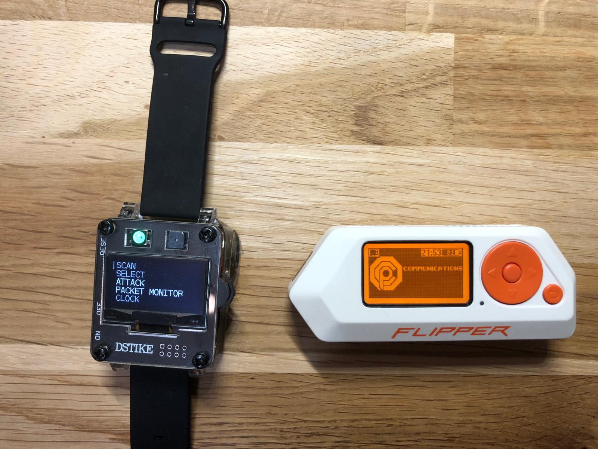

# Flipper Zero Scripts Collection

Welcome to my own collection of custom **Flipper Zero scripts**, dumps, and tools! </p>
This repository is designed to support the latest OS releases and enhance your Flipper Zero experience. </p>
Whether you're looking for powerful scripts for Wi-Fi hacking, or exploring the endless possibilities of the Flipper Zero, you'll find something here to play with!
## My Hardware

#### [WiFi Board (ESP8266 ESP DEAUTHER + FlipperZero)](hardware/wifi_board)


## Overview

This repository contains a curated set of scripts and utilities specifically for the **Flipper Zero**. Included are custom-developed scripts, third-party tools, and various dumps that expand the functionality of your Flipper Zero. Additionally, I've included support for the **ESP8266 Deauther Watch**, which does not jet integrate seamlessly with Flipper Zero hardware. 

You'll also find resources to help you with building and customizing your own scripts, as well as guides on how to get the most out of your device.

## Key Features

- **Custom Scripts**: A collection of scripts to enhance your Flipper Zero’s functionality.
- **Dumps and Tools**: Useful tools and resources to unlock additional capabilities of your Flipper Zero.
- **Compatibility with New OS Releases**: This repository is updated regularly to ensure compatibility with newer OS releases, windows, mac, linux, ios and android.
- **Third-Party Kernel Software**: Information and integration of third-party kernel software to extend functionality. More on that in the [Flipper Graphics repository](https://github.com/Kuronons/FZ_graphics).

## Installation

**Clone the repository**:
   ```bash
   git clone https://github.com/YourUsername/Flipper-Zero-Scripts.git
   cd Flipper-Zero-Scripts
