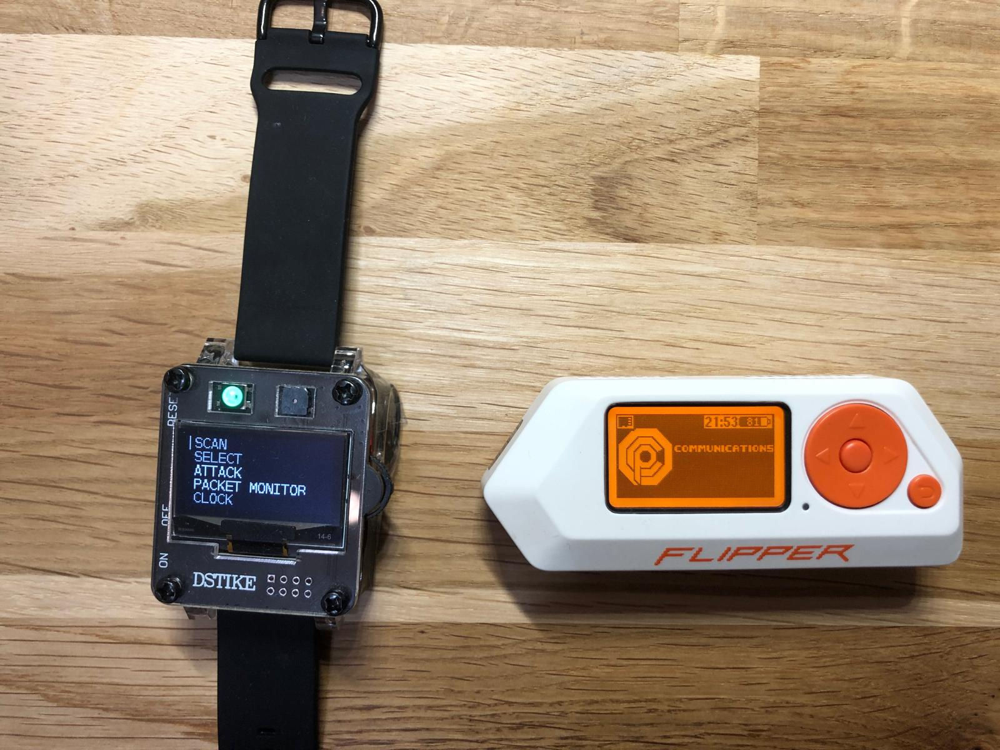

# 🐬 Flipper Zero Scripts Collection

Welcome to my curated collection of custom **Flipper Zero** scripts, dumps, and tools!  
This repository is built to support the latest OS releases and supercharge your Flipper Zero experience.  

Whether you're diving into Wi-Fi testing, signal exploration, or building your own utilities, you'll find something fun and functional here!  

---

## 🔧 My Hardware Setup

- **WiFi Board:** ESP8266 DSTIKE Deauther  
- **Flipper Devices:** Flipper Zero + Flipper Zero Wi-Fi Devboard  

---

## 📦 What's Inside

This repo features a handpicked set of tools and scripts tailored for **Flipper Zero** users. Inside you'll find:

- 🔸 **Custom Scripts** – Boost your Flipper’s capabilities with purpose-built and community-enhanced scripts.  
- 🗃️ **Dumps & Utilities** – A variety of tools to unlock advanced use cases.  
- ⚙️ **Third-Party Tools** – Integration with community-developed software (see the [Flipper Graphics repo](https://github.com/Kuronons/FZ_graphics) for more).  
- 🔄 **OS Compatibility** – Scripts tested and tuned for the latest releases on Windows, macOS, Linux, iOS, and Android.  

---

## 🚀 Features

- 📜 Powerful Wi-Fi deauth tools using ESP8266-based boards.  
- 🔐 IR, RF, NFC, Sub-GHz scripts and dumps.  
- 🛠️ Customization support for scripting your own automations.  
- 🌐 Experimental integrations for hardware like the **ESP8266 Deauther Watch** *(currently in testing phase—full Flipper support coming soon)*.  

---

## 📚 Get Started

Stay tuned for setup guides, walkthroughs, and script explanations to help you unlock the full potential of your gear.

---

## ❤️ Contributions & Feedback

Feel free to fork, star ⭐️, and submit pull requests! Have ideas or issues? Drop them in the [Issues](https://github.com/your-repo/issues) tab or reach out directly.

